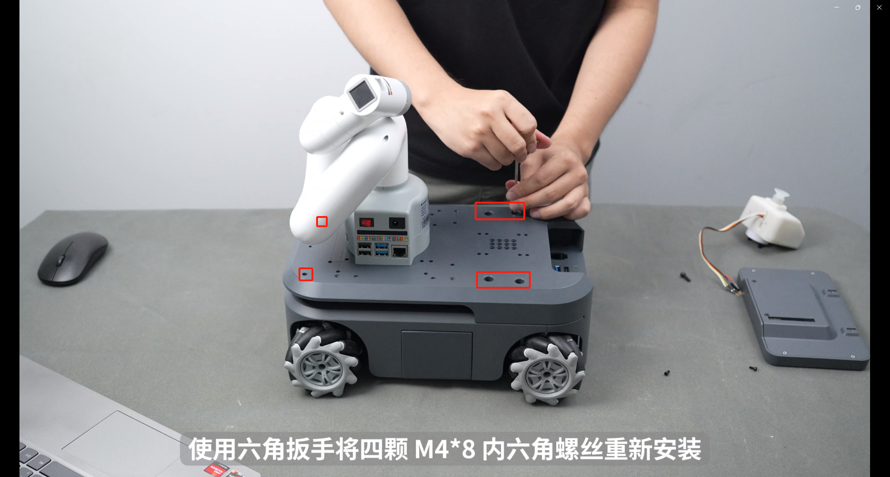

# 二维码识别搬运场景

<video id="Experiment 1" class="video-js" controls preload="auto" width="100%"
poster="" data-setup='{"aspectRatio":"16:9"}'>
  <source src="https://download.elephantrobotics.com/Product_box_open_vedio/%E5%AE%9E%E9%AA%8C%E4%B8%80%20%E5%A4%8D%E5%90%88%E6%9C%BA%E5%99%A8%E4%BA%BA%E5%88%9D%E6%AD%A5%E6%95%99%E7%A8%8B.mp4"></video>

<video id="Experiment 16" class="video-js" controls preload="auto" width="100%"
poster="" data-setup='{"aspectRatio":"16:9"}'>
  <source src="https://download.elephantrobotics.com/Product_box_open_vedio/%E5%AE%9E%E9%AA%8C%E5%8D%81%E5%85%AD%20%E5%A4%8D%E5%90%88%E6%9C%BA%E5%99%A8%E4%BA%BA%E8%A7%86%E8%A7%89%E8%BF%90%E8%BE%93%E5%A5%97%E8%A3%85%E5%AE%9E%E6%93%8D.mp4"></video>

## 1.场景搭建

使用3*3白色长挡板构建场地，按照图中的区域正确摆放


白色挡板通过黑色连接卡扣安装在一起


## 2.上下料台组装

上下料台安装方式一样，下面是下料台的安装说明


取出一个280mm铝型材


装入一个滑块螺母


向后旋转90°


装入两个滑块螺母


再向后旋转90°


两侧装入角槽连接件


两侧装入直角连接件 


取出一个147.5mm铝型材，内部装入两个滑块螺母


同理，右侧也是装入两个滑块螺母并通过直角连接件连接在一起


取出另一个280mm铝型材，两侧接上角槽连接件和直角连接件，并连接在一起


组装效果如下


取出螺丝和内六角扳手，固定四周的直角连接件，总共固定16颗螺丝 


装上四个110mm的铝型材


同样也是使用螺丝固定四周的直角连接件，总共固定8颗螺丝


内部使用同一规格螺丝固定，总共固定8颗螺丝


取出最后一块232mm铝型材，装上两个滑块螺母和两个角槽连接件


角槽连接件插入铝型材凹槽中 


整体翻转过来，通过螺丝固定连接件


确定五个滑块螺母位置，安装亚克力板


将二维码贴纸粘贴到二维码打印件上，注意粘贴方向不要贴反


通过螺丝固定二维码打印件


调整滑块螺母，通过螺丝固定防撞块


安装完成的最终效果


## 3.复合机器人组装

使用内六角扳手，取下myAGV四颗M4*8内六角螺丝


使用内六角扳手，取下myAGV两颗M2.5 内六角螺丝


将myCobot280Pi机械臂的X轴对应正确方向进行安装，并用四颗M4*8螺丝固定280Pi


 
重新固定M4*8和M2.5内六角螺丝



各关节回零（对齐刻度线）


摄像头插上乐高积木件


第六关节顺时针旋转45°，对准孔位，将摄像头水平平齐安装


摄像头的USB线接到280Pi底座的USB接口上


一体式吸泵插上乐高积木件


将吸泵Grove接口的线绕过来接到机械臂末端的io口上，只接两根线G23和G33


将电源接到机械臂第六关节处，接上5V和GND


连接机械臂电源线，一端接在myAGV上，另一端接在机械臂底座上


安装置物托盘


触摸屏幕是选购产品
下面说明屏幕组装安装说明

从配件盒中取出 IPS 触摸屏、铰链和配套螺丝，用螺丝固定铰链


安装黑色连接件，注意黑色连接件安装的方向，安装固定螺丝


将螺钉拧紧到与连接器相对应的三个螺孔中


将 HDMI 线 和 Micro USB2 连接到 myAGV


最终安装效果


## 4.myCobot校准零点

把myCobot280pi底座的micro HDMI接口接到显示屏上，同时usb接口接上鼠标键盘，现在相对于显示控制的是myCobot280pi画面。


连接完成后，桌面呈现所连设备的界面，如下图所示。


双击界面的ROS1 Shell，打开一个控制台终端，在命令行中输入图中以下指令

```
cd mycobottesttool-221110/
```
```
python main.py
```


指令输入完成后，弹出下出窗口，选择相应的设备和波特率，然后点击连接；
myCobot 280-Pi：1000000


开机后机械臂各关节处于锁死状态，点击校准零点，释放机械臂关节J1，手动将机械臂J1关节归于零位，再次点击校准零点，释放机械臂关节J2，依次类推校准完至J6关节。界面出现校准结束，机械臂校准完成。


其中第六关节的校位应如下图所示(保持摄像头与地面平行，校准口约偏移45°)：


## 5.远程软件使用
### 5.1下载mobaXterm远程软件

浏览器输入下面的[网址](https://mobaxterm.mobatek.net/)，电脑提前下载远程连接软件

```
https://mobaxterm.mobatek.net/
```


直接运行.exe文件即可


### 5.2远程连接myAGV和280Pi

按下电源开关，打开myAGV的电源


打开myAGV的wifi热点：断开当前连接的wifi，然后点击热点开关按钮，第一次需要手动开启，后续则会开机自动启动热点。


打开myAGV的wifi热点后，在桌面的右上角可以看到myagv的热点名称：ElephantRobotics_AP_xxxx，这里myAGV的热点为ElephantRobotics_AP_fdff。


选中"Connection information"可以查看当前myAGV的ip地址：10.42.0.1


然后拔掉myAGV的显示器接线，把myCobot280pi的micro HDMI接口接到显示屏上，现在相对于显示的是myCobot280pi画面


myCobot280pi连上刚刚myAGV生成的wifi热点:Elephantrobotics_AP_fdff


选中"Connection information"可以查看当前myCobot280Pi的ip地址:10.42.0.203


接下来操作需要一台电脑，电脑连接myAGV的wifi热点，这里myAGV的热点为ElephantRobotics_AP_a317，选择安全密钥进行连接，然后输入热点密码：Elephant


使用mobaXterm连接myAGV，点击Session图标


输入小车的ip：10.42.0.1，点击OK，第一次连接设备点击Accept


输入用户名：er
输入密码：Elephant
密码在输入时不会显示出来，正常输入后敲下回车键登录


正常登录显示的画面


同理，也可以远程登录myCobot280，登录的ip地址要改为刚刚查询的IP地址：10.42.0.203

## 6.程序运行

最后确保复合机器人放在红框位置启动，在上料区工作台放置二维码木块，二维码木块的放置位置应在机械臂摄像头扫描的中心位置，中心扫描吸取的误差较小。确保未开启其他终端窗口。

总共需要跑四个程序，myAGV需要运行三个终端，myCobot280要运行一个终端


### 6.1 myAGV开启雷达和底层通信

在第一个终端输入下面的指令

```
cd myagv_ros/src/myagv_odometry/scripts/
```

```
./start_ydlidar.sh
```

```
roslaunch myagv_odometry myagv_active.launch
```


### 6.2 myAGV启动导航功能

1.鼠标右键上方ip地址，点击Duplicate tab，打开第二个终端


2.同理也需要登录用户名和密码，分别是er和Elephant


3.在第二个终端下输入下面这个指令

```
roslaunch myagv_navigation composite_robot_navigation_active.launch
```


### 6.3 myAGV启动socket服务端

1.鼠标右键上方ip地址，点击Duplicate tab，打开第三个终端


2.同样也需要登录用户名和密码，分别是er和Elephant


3.在第三个终端下输入下面这个指令

```
cd ~/Composite-robot-kit/myagv-pi/
```

```
python agv_socket_server.py
```


### 6.4 myCobot280启动socket客户端

1.点击Session图标，登录的ip地址要改为刚刚查询myCobot280的IP地址，这里查询的ip地址是10.42.0.13


2.同样也需要登录用户名和密码，分别是er和Elephant


3.在终端下输入下面这个指令

```
cd ~/Composite-robot-kit/myagv-pi/
```

```
python 280pi_socket_client.py
```

点击Split中的4 terminals mode方便查看代码运行情况


在 myCobot 机械臂 IP:10.42.0.13 终端窗口提示

```
connect finish
Enter any key and press enter
```

按下回车或任意键，等待机械臂发送指令后，整个流程就进行了。

复合机器人会根据指令完成自动导航，机械臂能够准确识别并抓取二维码积木
流程：

① myAGV 定点导航
② myAGV 二维码导航
③ myCobot 二维码识别
④ myAGV 定点导航
⑤ 机械臂放取


## 7.注意事项

问题 1：在吸泵吸取过程中可能出现吸泵吸取的并非物料的中心位置。

解决方案：在计算机上观察摄像头的扫描区域，将物料放在尽量处于摄像头的中心 位置。


问题2：二维码识别吸泵吸取时，存在固定的误差。

解决方案：观察X，Y轴的误差量，在280pi_socket_client.py代码第85行中增大或者减小X，Y误差。


问题3：在吸泵将物料放置到小车托盘中时可能存在放置不精准，触碰到托盘边缘 导致放置失败。 


解决方案：
(1)机械臂重新进行校准零位
(2)校准放取木块点位

下面是校准放取木块点位的介绍，先使用远程软件通过ip地址连接机械臂，然后终端输入python，回车进入命令行模式，输入下面的指令

```python
from pymycobot import MyCobot
mc = MyCobot('/dev/ttyAMA0',1000000)
mc.release_all_servos()
```


将吸泵对准二维码中心


接着在python命令行中输入下面的指令

```python
mc.power_on
coords=mc.get_coords()
coords[2]+=58
mc.send_coords(coords,20)
mc.get_angles()
```

接着就会返回当前的关节角度，

```
[-51.85, 20.39, -116.45, -2.81, 7.38, 26.01]
```

将这关节角度修改到280pi_socket_client.py代码中

