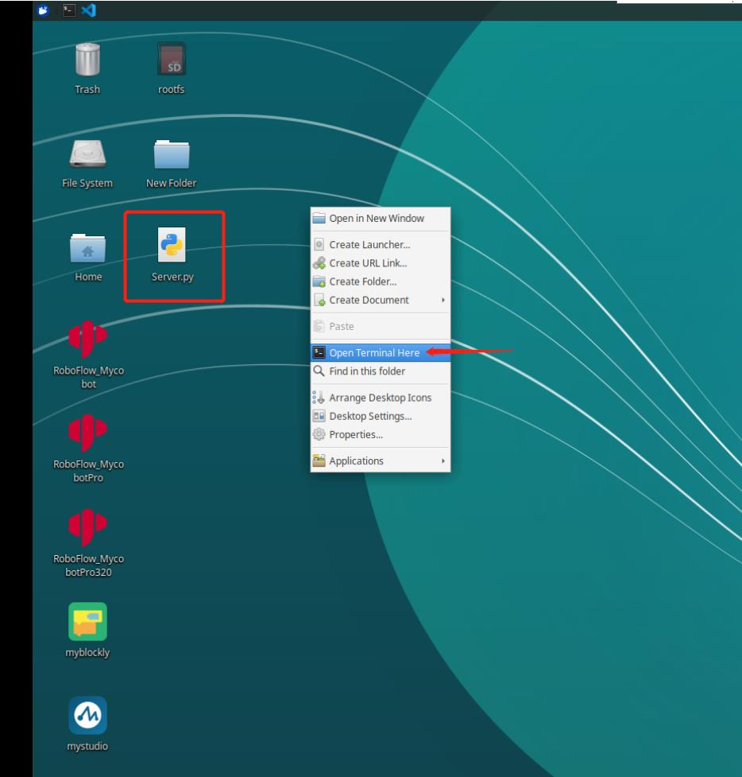

# myAGV 与机械臂通讯控制

## Pi 版本

### WIFI 通讯控制

**注：** 只支持 myCobot 280 Pi、myPalletizer 260 Pi、mechArm 270 Pi

1、配置机械臂

**Step 1** 首先机械臂连接显示屏开机，点击 WIFI 图标，连接 WIFI，并输入 WIFI 密码，点击 Connection，成功连接。

**Step 2** 点击桌面 pymycobot 文件，点击 demo 文件，把 Server.py 文件拷贝到桌面上。

**Step 3** 打开命令终端



**Step 4** 输入以下代码运行脚本：

```python
sudo python3 Server.py
```

**Step 5** 运行成功如图：


2、myAGV 通讯控制案例

小车正常开机连接显示屏与键鼠，以上步骤确保连接好，接下来就可以使用小车控制机械臂啦。

**注意：机械臂需要和小车在同一网段下，即同一 WIFI 下。**

- myCobot 280、mechArm 270：

```python
from pymycobot import MyCobotSocket
# 默认使用9000端口
#其中"192.168.10.22"为机械臂IP，请自行输入你的机械臂IP
mc = MyCobotSocket("192.168.10.22",9000)
mc.connect()

#连接正常就可以对机械臂进行控制操作
mc.send_angles([0,0,0,0,0,0],20)
res = mc.get_angles()
print(res)

...
```

- myPalletizer 260：

```python
from pymycobot import MyPalletizerSocket
# 默认使用9000端口
#其中"192.168.10.22"为机械臂IP，请自行输入你的机械臂IP
mc = MyPalletizerSocket("192.168.10.22"，9000)
mc.connect()

#连接正常就可以对机械臂进行控制操作
mc.send_angles([0,0,0,0],20)
res = mc.get_angles()
print(res)

...
```

---

[← 上一页](7.1-InstallationInstructions.md) | [下一章 →](../8-FilesDownload/README.md)
