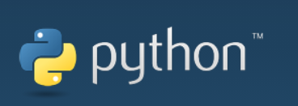

# 什么是 Python？

## 

**Python** 由荷兰数学和计算机科学学会的 Guido van Rossum 于 20 世纪 90 年代初设计，是一种名为 ABC 的语言的替代品。

**Python** 不仅提供高效、先进的数据结构，还能用于进行简单有效的面向对象编程。

**Python** 的语法和动态类型以及解释型语言的特性，使其成为在大多数平台上编写脚本和快速开发应用程序的编程语言。随着版本的不断更新和新功能的增加，它逐渐被用于开发独立的大型项目。

**Python** 的解释器易于扩展，可使用 C 或 C++语言（或可通过 C 语言调用的其他语言）扩展新函数和数据类型。

**Python** 还可用于扩展定制软件中的程序语言。**Python** 拥有丰富的标准库，并提供适合各主要系统平台的源代码或机器代码。

---

[← SDK 开发指南页](../README.md) | [下一页 →](7.1.1-download.md)
