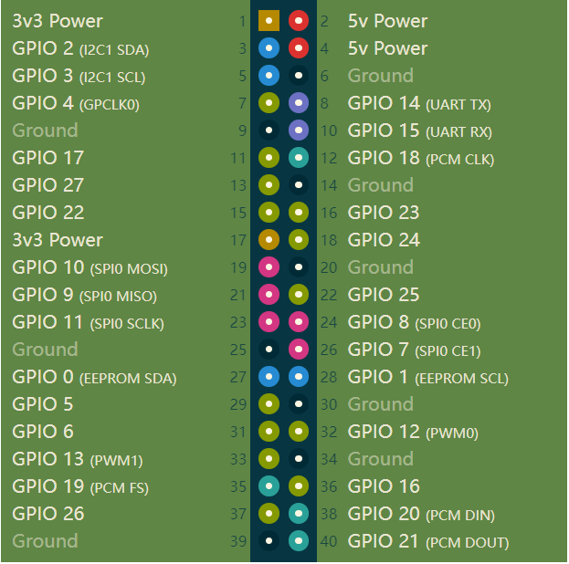

# Electrical characteristic parameter

## 1 Overview of electrical interfaces

   

   

| Number | Interface | Definition | Function | Remark |
| :----: | :-------: | :-------: | :------: | :----: |
| 1      | Switch |    | control input power on and off | With lights (lights on) |
| 2      | Power supply interface of robot arm |    | Supply power to my series robot arm (12V 5A) |    |
| 3      | DC/IO interface | 3.3  | DC3.3V  |    |
|        |                 | 17   | GPIO 17 |    |
|        |                 | 27   | GPIO 27 |    |
|        |                 | 22   | GPIO 22 |    |
|        |                 | 10   | GPIO 10 |    |
|        |                 | 9    | GPIO 9  |    |
|        |                 | 11   | GPIO 11 |    |
|        |                 | G    | GND     |    |
|        |                 | 10   | GPIO 10 |    |
|        |                 | 23   | GPIO 23 |    |
|        |                 | 24   | GPIO 24 |    |
|        |                 | 25   | GPIO 25 |    |
|        |                 | 8    | GPIO 8  |    |
|        |                 | 7    | GPIO 7  |    |
| 4      | USB2.0 | USB2.0*2 | Can be connected to external devices or U disk shion |    |
| 5      | HDMI |    | use to connect a screen |    |
| 6      | network port | Ethereum | Ethernet port communication |    |
| 7      | Power DC Input interface | DC 12V | 	power input |    |
| 8      | Standby battery port |    | Connects the standby battery |    |
| 9      | Suction pump interface |    | connect suction pump, control suction pump work |    |

#### 1.1 Switch : Power switch is used to control the main power input. If it is switched off, the controller is also powered off.

#### 1.2 Power supply interface of robot arm : banana plug female, model XT30UPB-F, to supply power to my series robot arm (12V 5A).

#### 1.3 DC/IO interface : The IO interface group is Dupont interface of 2.54mm, and 2.54mm Dupont wire can be used externally.

| Label | Signal | Type | Function | Notes |
| :---: | :----: | :--: | :------: | :----: |
| 3.3 | 3.3V | P | DC 3.3V |  |
| 17 | GPIO17 | I/O | GPIO17 |  |
| 27 | GPIO27 | I/O | GPIO27 |  |
| 22 | GPIO22 | I/O | GPIO22 |  |
| 10 | GPIO10 | I/O | GPIO10 |  |
| 9 | GPIO9 | I/O | GPIO9 |  |
| 11 | GPIO11 | I/O | GPIO11 |  |
| G | GND  | p | GND |  |
| 18 | GPIO18 | I/O | GPIO18 |  |
| 23 | GPIO23 | I/O | GPIO23 |  |
| 24 | GPIO24 | I/O | GPIO24 |  |
| 25 | GPIO25 | I/O | GPIO25 |  |
| 08 | GPIO8 | I/O | GPIO8 |  |
| 07 | GPIO7 | I/O | GPIO7 |  |

> **Notice:** 
> 1. I: As input only
> 
> 2. I/O: This function signal includes input and output combination.
> 
> 3. When the single tube corner is set as the output terminal, it will output 3.3V voltage.
> 
> 4. The source current of a single tube angle decreases with the increase of the number of pins, from about 40mA to 29mA.
> 
> 5. If a certain GPIO is set to the output mode and outputs a high level signal, the circuit connected to the LED is shown in Figure 2 , and the LED will light up.
> 
> 
> 
> 6. In the case of using other functions, the IO function is unavailable, and the other function table of the function interface is shown in Figure 3 .
> 
> 
> 

#### 1.4 USB2.0 : Serial port with the standard of main line for 2.0 interface. The USB port is used to copy program files and connect peripherals such as mouse and keyboard.

#### 1.5 HDMI : The HDMI D-type port connects with the monitor.

#### 1.6 network port : Ports for network data connection. Ethernet interfaces can be used for communication between a PC and a robot system or for Ethernet communication with other devices.

#### 1.7 Power DC Input interface : Use DC 2.5*5.5 power port; The myAGV can be charged using the factory-supplied 12.6V2A DC power adapter.

#### 1.8 Standby battery port : Connects the standby battery

#### 1.9 Suction pump interface : connect suction pump, control suction pump work

---

[← Previous Page](README.md#chapter-summary) | [Next chapter →](../3-UserNotes/README.md)