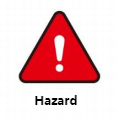

# Safety Instructions

## 1 Synopsis

This chapter details general safety information for personnel performing installation, maintenance, and repair work on elephant robots. Read and understand the contents and precautions in this chapter before carrying, installing, and using it.

## 2 Hazard identification

The safety of robots is based on the proper configuration and use of robots. Furthermore, injury or damage caused by the operator may occur even if all safety instructions are followed. Therefore, it is very important to understand the safety risks of robot use in order to prevent them.

Table 1-1 to 3 lists the common security risks that may occur when robots are used∶

Table 1-1 Risk level Security risks

|
| 
| :--- |
| 1 Personal injury or robot damage caused by improper handling of the robot. |
| 2 The ground slope grade (ramps, etc.) cannot exceed 5% as this may cause the robot to slip. Only drive on uniform and dry surfaces, wet and uneven surfaces may cause the robot to slip. |
| 3 The robot's safety function fails to play its role due to the incorrect configuration of safety functions or the lack of safety protection tools. |

Table 1-2 Warning security risks

| 
| 
| :--- |
| 1 Do not stay within the moving range of the robot when debugging the program. Improper safety configurations may not prevent collisions that may cause personal injury. |
| 2 The robot's connection to other devices may lead to new hazards, requiring a thorough re-assessment of the risk. |
| 3 It is strictly prohibited to carry non-standard items, such as flammable and explosive materials, etc. |
| 4 The robot is a precision machine. Stepping on the robot may cause damage. |
| 5 The maximum payload of the top load of the robot is 5 kg. If it is exceeded, it may cause overturning, load drop and machine damage; |
| 6 The robot is a precision machine, which may cause vibration and damage to the internal parts of the robot if it cannot be placed smoothly during handling. |

Table 1-3 Potential safety hazards that may lead to electric shock

| 
| 
| :--- |
| 1 Unknown hazards may arise when using non-original cables. |
| 2 Electrical equipment contact with liquid may cause leakage hazard. |
| 3 Electrical connection error may cause electric shock. |
| 4 Be sure to switch off the power supply of the controller and related devices and remove the power plug before replacement. If the operation is carried out with power on, it may cause electric shock or failure. |

## 3 Safety Precautions

The following safety rules should be followed when using the myagv:

-  The myagv belongs to live equipment. Non-professionals are not allowed to change the circuit at will, otherwise it may cause damage to the equipment or human body.
- When operating myagv, comply with local laws and regulations. The safety precautions and dangers, Warnings, and precautions described in this manual are only supplements to the local safety regulations.
- Please use myagv indoors. Exceeding the specifications and load conditions of myagv will shorten the service life of the product or even damage the equipment.
- The person installing, operating and maintaining the myagv, anyway, has to be rigorously trained on safety precautions and the right way to operate and maintain the robot.
- Anyway, don't use the product in humid environments for long periods of time. This product is a precision electronic component, which will damage the equipment in damp environment for a long time.
- Highly corrosive cleaning is not suitable for cleaning the myagv, and anodized parts are not suitable for immersion cleaning.
- Do not disassemble, disassemble, or unscrew the screws or shell of the manipulator. If disassembled, no warranty service can be provided.
- Personnel without professional training are not allowed to repair the faulty products and dismantle the myagv without permission. If the products fail, please contact technical support engineers in time.
- If the product is discarded, please comply with the relevant laws to properly dispose of industrial waste and protect the environment.
- A child uses a device at some point, forcing someone to monitor the process and switch it off when it's finished.
- It is strictly prohibited to change, remove or modify the nameplate, description, icon and mark of myagv and related equipment.
-  Please be careful in handling and installation. Put the robot gently according to the instructions on the packing case and place it correctly in the direction of the arrow. Otherwise, the machine may be damaged.
- **Do not use unofficial recommendations to burn firmware. If the device is damaged because the user burned other firmware, it is not covered by after-sales service.**

**If you have any questions or suggestions about the contents of this manual, please log in the official website of Elephant Robot and submit relevant information：**

https://www.elephantrobotics.com

**Please do not use the myagv for the following purposes：**

- Cost of healthcare in life-critical applications.
- Buying a bus can cause an explosion in an environment.
- Lent is used directly without a risk assessment.
- Cost of using a security function at a low level.
- Lo-fi does not conform to the use of robot performance parameters.

---
[← Previous Page](README.md#chapter-summary) | [Next Page →](3.2-TransportandStorage.md)