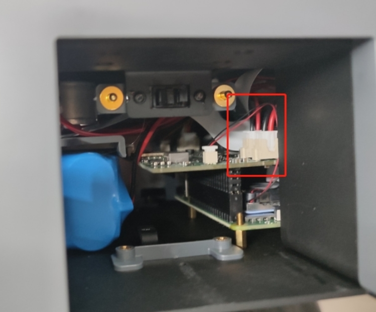

# Hardware problem

**Q: What is the model of AGV radar? Can you provide the performance parameters of the radar?**

- A: YDLIDAR X2L
About fov horizontally is 0-360°, vertically is 0-1.75°
4000 points, 4000 times per second


**Q: Where is the installation method of the 7-inch screen? What to do if it cannot display?**

Please refer to the link for screen installation and connection method:
AGV installation screen:
https://docs.qq.com/doc/DU1p0VnBCRkFIQk9J
https://docs.qq.com/doc/DU2xWd29ldkFHcFNR

**Q: Does AGVJN have a built-in network card?**

A: Yes, it has a built-in wireless network card

**Q: Can AGV be used as a composite robot with myArm300pi? How?**

A: The steps to start the AGV and myarm300 composite robot are as follows:
1. Start the Server.py file in myarm,
Download path: https://github.com/elephantrobotics/pymycobot/blob/main/demo/Server.py
Note: The Server.py file is required and the baud rate 1000000 in the file is changed to 115200
2. Start the Client.py file in myAGV. The control code in Client.py supports customization, for example

```python
from pymycobot import MyArmSocket
import time
mc = MyArmSocket("192.168.10.97",9000)
for i in range(3):
mc.send_angles([0, 0, 0, 0, 0, 0, 0], 50)
print(mc.get_angles())
time.sleep(2)

mc.send_angles([90, 0, 0, 0, 0, 0, 0], 50)
print(mc.get_angles())
time.sleep(2)

```

**Q: Can AGV use other 3D cameras, such as D435? How should I find its launch file?**

A: Currently, Intel's D435 camera has not been adapted. Now there is only Obbec's. If you want to use this Intel camera, it is recommended to refer to the development manual of the 3D mapping algorithm and develop it yourself

**Q: How to deal with abnormal use of AGV handle?**


**Q: What should I do if the charger cannot be charged?**

1. Please confirm that you are using the power adapter we provide
2. Can you tell me whether the reason why this AGV cannot be charged for one hour is that after the matching screen is connected, the screen does not display any system screen or the power button light does not light up after the AGV power switch is turned on?
3. If the AGV power light is on, have you tried to replace the HDMI screen to see if you can enter the AGV system and further check whether the AGV motor can be controlled normally?
4. If the AGV power light is not on, can you open one of the side hatches of the AGV after connecting the power adapter and take a picture of the inside for me to see? I need to see if there is an indicator light inside
5. When the AGV is charging for 1 hour, are you sure that the power button of the AGV is turned off? When the power button is pressed, that is, the AGV is started, it is used while charging, and the charging effect will be relatively poor. So when charging, the power button switch needs to be turned off. Is this how you charge it?
6. The two terminals circled in the picture below are the key to charging connection. You need to check if any cables are disconnected. You can try to unplug and replug these two terminals.




**Q: Is there any way to check if the battery is fully charged?**

A: After charging for about 1 hour, you can turn on the system and check the voltage and current values ​​in the visual UI

**Q: Can the main battery and the backup battery be charged together? Can the backup battery be charged on the car?**

A: Put the backup battery in the battery compartment. It will start charging when it is below 11V. The main battery will be charged first, and then the backup battery

**Q: What should I do if the serial port number /dev/ttyACM0 cannot be recognized?**

Disassemble the right rear wheel, reinstall the serial port cable, and then use the command ls /dev/tt* to check whether it is recognized normally. Note that you cannot pull out the serial port cable by force. You should gently lift the plastic sheet and then remove the cable. You can refer to the removal of the csi cable.


**Q: Which is the motor control pin?**

Please refer to the following 4 groups of pins, 2 of which control 1 motor, but we only provide integrated motor control interface. We cannot provide support for the use of pins, and you need to do secondary development yourself.
32 33
25 26
27 14
18 23

**Q: Can you provide the line sequence corresponding diagram of the 4 motors of the car and the motor interface of the driver board?**


**Q: How to replace the expansion board of the car?**

A: Refer to the video: https://drive.google.com/file/d/1NYZTkAqMKsrFyl1-HzsuKRmJr6ksMpvL/view?usp=sharing

**Q: Is there anything I need to pay attention to when disassembling and assembling the CSI camera?**

A: Please note that when installing or removing the CSI ribbon cable, please gently pull or push the plastic sheet, and do not pull the CSI ribbon cable directly.
Removal of the CSI ribbon cable


Installation of the CSI ribbon cable


**Q: What is the power of the myCobot Pro 600 robot arm when it is working?**

- A: 240W 48V 5A

**Q: Where is the base coordinate origin of 600/630?**

The base coordinate origin of 600/630 is at the position of ② (as shown in the figure), not at the position of ①


**Q: Re-zero calibration in cmd: this is not necessary, (Encoder abnormality troubleshooting-600)**

- A: It may be because the motor encoder has an error due to long-term non-use. Now please disassemble the housing of manipulator J2 and J3, check whether there is a red light in the encoder, find the encoder line, press it, and the encoder will have a green light, and it can be used normally.


**Q: What is the 630 master control? What is the native system?**

- A: Raspberry Pi 4B 8G memory debian system

**Q: Why does the Raspberry Pi cause the phenomenon of being unable to enter the operating system?**

- A: There are two possibilities. The first is that the instantaneous current causes the TF card and the Raspberry Pi system image to be damaged. It may also be that the TF card capacity is insufficient and the papermaking system is hung up. Because the factory memory left for customers is not much, most of it is occupied by the mycobot_ros folder. Customers can delete the folders except for the model product before the product has a black screen and prompts insufficient memory to reserve product usage space. If there is too much memory data, it cannot be turned on when it is full.

**Q: What are the specifications of the DC port of the 600/630 charger?**


