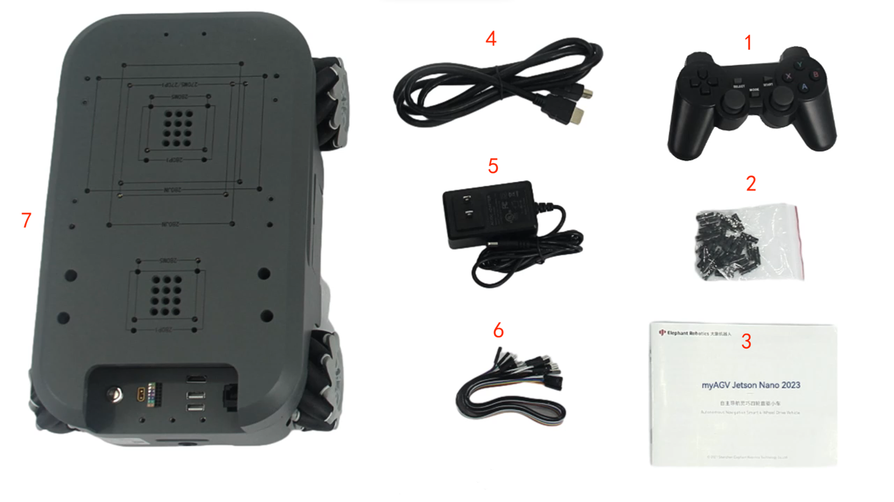

# Product Standard List

## 1 Product List Picture

Each product is numbered and detailed to ensure you can accurately refer to your listing.

## 2 Product Standard List Comparison Table

| Serial number | Product                                        |
| ------------- | ---------------------------------------------- |
| 1             | joystick                                       |
| 2             | Building Blocks Plugin                         |
| 3             | Product Manual                                 |
| 4             | HDMI Cable                                     |
| 5             | 12.6V, 2A power adapter and DC power interface |
| 6             | jump wire                                      |
| 7             | myAGV Pi 2023                                  |

**Note:** After the packaging box is in place, please confirm that the robot packaging is intact. If there is any damage, please contact the logistics company and the supplier in your region in time. After unpacking, please check the actual contents in the box according to the item list.

## 3 Optional product list

myAGV Pi 2023 now offers two optional product accessories, namely a 7-inch high-definition IPS touch display and a 6400mAh original spare battery.

| Serial number | Product                                             |
| ------------- | --------------------------------------------------- |
| 1             | 6400mAh original spare battery                      |
| 2             | 7-inch high-definition IPS touch display            |
| 3             | Screws for 7-inch high-definition IPS touch display |

---
[← Previous Page](README.md) | [Next Page →](4.2-ProductUnboxingGuide.md)
