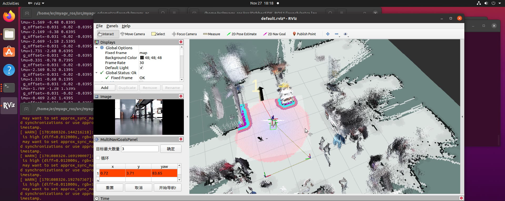
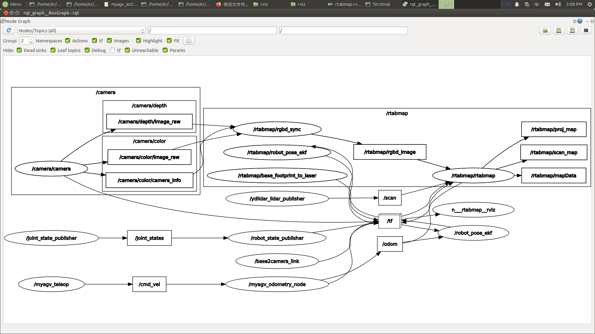

### Using Common ROS Tools

- Launch Files

A Launch File in ROS is a means of simultaneously starting multiple nodes. It can also automatically launch the ROS Master node manager and facilitate various configurations for each node, providing great convenience for the operation of multiple nodes.

   （1）`<launch>` Tag

The `<launch>` tag acts like a large bracket, defining a specific area. All launch files start with `<launch>` and end with `</launch>`. All descriptive tags must be written between `<launch>` and `</launch>`.

```
<launch>
……
……
</launch>
```

   （2）`<node>` Tag

The `<node>` tag is one of the most commonly seen tags in launch files. Each `<node>` tag includes properties for the node's name in the ROS graph (`name`), the package in which the node is located (`pkg`), and the type of the node (`type`). The commonly used format is as follows:

```
<node pkg="package-name" type="executable-name" name="node-name" />
```

| Tag Attribute |                        Attribute Function                        |
| :--------------- | :---------------------------------------------------- |
| name="NODE_NAME"  | Assigns a name to the node, overriding the `node_name` defined by `ros::init()` |
| pkg="PACKAGE_NAME |                  Name of the package containing the node                  |
| type="FILE_NAME"  |                Executable file name for the node                |
|  output="screen"  |  Outputs the node's standard output to the terminal screen; default is logging file  |
|  respawn="true"   | When set to true, the node automatically restarts upon termination; default is false |
| ns = "NAME_SPACE" |     Namespace that adds a namespace prefix to relative names within the node     |
| args="arguments"  |                  Input arguments required by the node                  |


   （3）`<include>` Tag

This tag allows the inclusion of another roslaunch XML file into the current file.

|                  Tag Attribute                  |        Attribute Function        |
| :---------------------------------------- | :-------------------- |
| file ="$(find pkg-name)/path/filename.xml" | Specify the files you want to include |

e.g.

```
<include file="$(find demo)/launch/demo.launch" />
```

   （4）`<remap>` Tag

The `<remap>` tag, as the name suggests, is used for remapping. ROS supports remapping of topics, and the `<remap>` tag includes an `original-name` and a `new-name`, representing the original and new names.

For example, suppose you have a node that subscribes to the "/chatter" topic, but your own node can only publish to the "/demo/chatter" topic. Since the message types for these two topics are the same, and you want these nodes to communicate, you can write the following in the launch file:

```
<remap from="chatter" to="demo/chatter"/>
```

This allows direct remapping of /chattertopic to /demo/chatter, enabling communication between the two nodes without the need to modify any code.

   （5）`<param>` Tag

The `<param>` tag functions similarly to the rosparam set command in the command line. For example, adding a parameter named demo_param with a value of 1.0 to the parameter server.

```
<param name="demo_param" type="int" value="1.0"/>
```

   （6）`<rosparam>` Tag

The `<rosparam>` tag allows importing a large number of parameters at once from a YAML file.

The usage is as follows:

```
<rosparam command="load" file="$(find pkg-name)/path/name.yaml"/>
```

   （7）`<arg>` Tag

"Argument" is another concept, similar to local variables within a launch file, limited to the usage within the launch file for the purpose of facilitating the refactoring of launch files, and is independent of the implementation within ROS nodes.

To set an argument, use the <arg> tag element with the following syntax:

```
<arg name="arg-name" default= "arg-value"/>
```

- Rviz

rviz is a three-dimensional visualization tool that is well compatible with various robot platforms based on the ROS software framework. In rviz, XML can be used to describe the attributes of robots, surrounding objects, and any physical entities, including dimensions, mass, position, material, joints, etc., and visually present them in the interface. Additionally, rviz can graphically display real-time information such as robot sensor data, robot motion status, and changes in the surrounding environment. In summary, rviz helps developers achieve graphical representation of all monitorable information. Developers can also control robot behavior through buttons, sliders, numerical inputs, and other means in the control interface of rviz. The image below shows the grid map, 3D point cloud map, and laser data displayed graphically during the map building process in rviz.



- Qt Toolbox

Computational Graph Visualization Tool (rqt_graph)
The rqt_graph tool provides a graphical representation of the computational graph in the current ROS system. To launch this tool when running the graph-building functionality, use the following command:

```
rqt_graph
```

After a successful launch, the computational graph is displayed as shown in the following image.



Visualization Tool for TF Relationships (rqt_tf_tree)

The rqt_tf_tree tool graphically displays the current TF relationships between running nodes. To launch this tool when running the graph-building functionality, use the following command:

```
rosrun rqt_tf_tree rqt_tf_tree
```

After a successful launch, the TF relationship graph is displayed as shown in the following image.


---

[← Previous Page](6.2.2-ROS_Installation.md) | [Next Page →](6.2.4-Basic_Control_Based_on_ROS.md)
