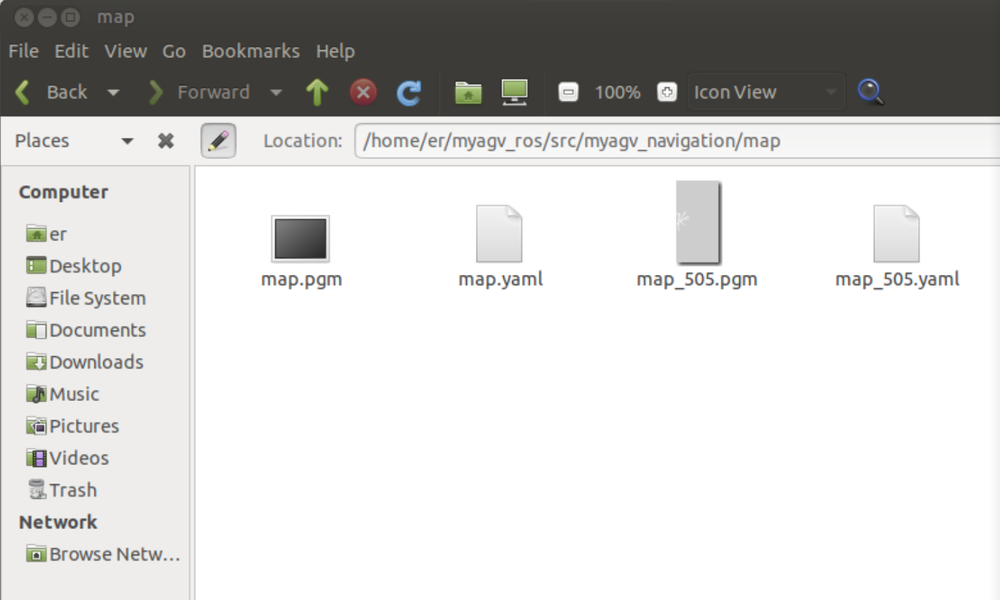

### Navigation-Map Navigation

Previously, we have successfully created a spatial map and obtained a set of map files, namely **map.pgm and map.yaml**, located in the directory ~/myagv_ros/src/myagv_navigation/map.



Now, let's see how to use the created map for navigation of the car.

- 1 Modify the launch file

Open and edit the **navigation_active.launch** file located at ~/myagv_ros/src/myagv_navigation/launch/.

```
cd ~/myagv_ros/src/myagv_navigation/launch
sudo gedit navigation_active.launch
```


Find the parameter "map_file" and **replace default="$(find myagv_navigation)/map/map.yaml"** with the desired parameter file for navigation. For instance, if you want to load **map_505.yaml**, change **/map/map.yaml** to **/map/map_505.yaml**. Then, save the modified file and exit. If you don't make any changes, it will default to loading the **map.yaml** file.


- 2 Run the launch files

After powering on the myagv, open a terminal console (shortcut: Ctrl+Alt+T) and enter the following command:

```
roslaunch myagv_odometry myagv_active.launch
```

Open another terminal console (shortcut: Ctrl+Alt+T) and enter the following command:

```
roslaunch myagv_navigation navigation_active.launch
```


- 3 You will see that an Rviz simulation window has been opened.

Explanation of the Navigation Control Panel in the Bottom Left Corner

① Maximum Number of Target Points: You can set the maximum number of target points. The number of set target points cannot exceed this parameter (but can be fewer).

② Loop: If checked, after navigating to the last target point, the robot will navigate back to the first target point. For example: 1 -> 2 -> 3 -> 1 -> 2 -> 3 -> ... This option must be checked before starting navigation.

③ Task Target Point List: x/y/yaw, the pose (xy coordinates and yaw) of the given target points on the map.After setting the maximum number of target points and saving, this list will generate the corresponding number of entries.When providing a target point, the coordinates and orientation will be read here.

④ Start Navigation: Begin the task.

⑤ Cancel: Cancel the current target point navigation task, and the robot will stop moving. Clicking "Start Navigation" again will resume from the next target point.

Example: 1 -> 2 -> 3. If you click "Cancel" during the 1 -> 2 process, the robot will stop. Clicking "Start Navigation" again will make the robot go from the current position to 3.

⑥ Reset: Clears all current target points.


- 4 Start Navigation

Set the number of target points for the task, and click to confirm and save. Then, click on "2D Nav Goal" on the toolbar to define the target point on the map. (Each time you set a point, start by clicking "2D Nav Goal"). The target points differentiate orientation, with the arrowhead representing the vehicle's heading direction. Click "Start Navigation" to begin the navigation. In Rviz, you will see a planned path from the starting point to the target point, and the vehicle will move along this route to reach the destination.


- 5 Precautions

**Note: It is recommended to place the car's initial position at the starting point where the car was located during mapping. If you need to modify the starting position, follow the steps below.**

Click on the "2D Pose Estimate" in the top toolbar to adjust the position so that the car in the Rviz interface matches the physical car. The terminal will then return the coordinates and heading angle of the car relative to the map.


Open and edit the "navigation_active.launch" file located in "~/myagv_ros/src/myagv_navigation/launch/". Find the "amcl" node, and replace "initial_pose_x", "initial_pose_y", and "initial_pose_a" with the coordinates and heading angle returned by the terminal in that order. After launching "navigation_active.launch" again, the robot's starting position will be updated.


---

[← Previous Page](6.2.5-Real-time_Mapping_with_Gmapping.md) | [Next Section →](../../7-ExamplesRobotsUsing/README.md)