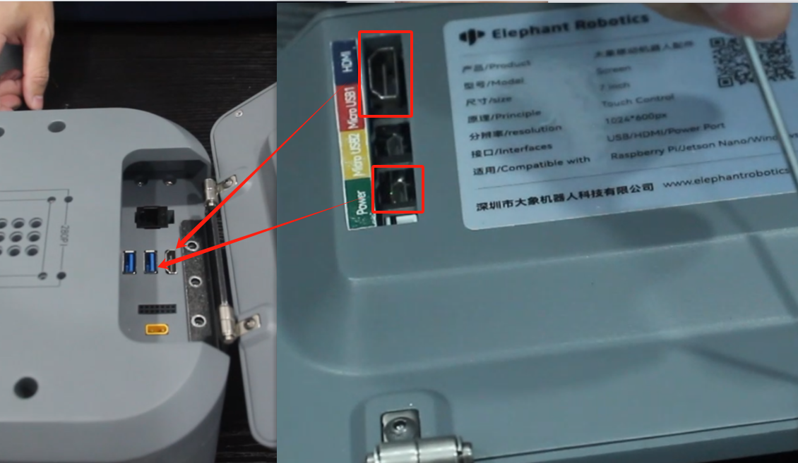
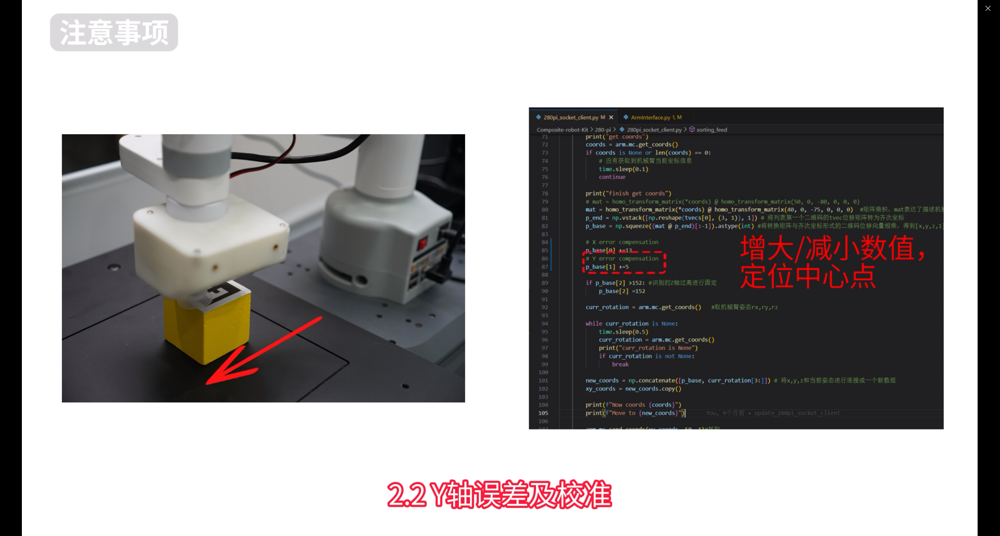

# Aruco code recognition and transportation scenarios

## 1.Scene Construction

Use 3*3 long white baffles to build the venue and place them correctly according to the area in the picture


The white baffle is mounted together with black connecting clips


## 2.Loading and unloading table assembly

The installation method of the loading and unloading table is the same. Here are the installation instructions for the unloading table


Take out a 280mm aluminum profile


Insert a slider nut


Rotate 90° backwards


Install the two slider nuts


Rotate back 90°


Angle slot connectors on both sides


Right-angle connectors on both sides


Take out a 147.5mm aluminum profile and install two slider nuts inside


Similarly, two slider nuts are installed on the right side and connected together through the right-angle connector.


Take out another 280mm aluminum profile, connect the angle slot connectors and right angle connectors on both sides, and connect them together


The assembly effect is as follows


Take out the screws and hex wrench, and fix the right-angle connectors around, a total of 16 screws


Install four 110mm aluminum profiles


The right-angle connectors around the perimeter are also fixed with screws, with a total of 8 screws


The same specification screws are used to fix the interior, a total of 8 screws are used


Take out the last piece of 232mm aluminum profile and install two slider nuts and two angle slot connectors


Angle slot connectors are inserted into the grooves of the aluminum profiles


Turn the whole thing over and fix the connector with screws


Determine the positions of the five slider nuts and install the acrylic plate


Paste the Aruco code sticker onto the Aruco code printout, making sure not to paste it in the wrong direction


Fasten the Aruco code printout with screws


Adjust the slider nut and fix the anti-collision block with screws


Final effect after installation


## 3.Composite robot assembly

Use an internal hexagon wrench to remove the four M4*8 internal hexagon screws of myAGV


Use an Allen wrench to remove the two M2.5 Allen screws on myAGV.


Install the myCobot280Pi robot arm with the X-axis in the correct direction and fix the 280Pi with four M4*8 screws.


 
Re-tighten the M4*8 and M2.5 hexagon socket screws


Return each joint to zero (align with scale lines)


The camera is plugged into the Lego building blocks


Rotate the sixth joint 45° clockwise, align it with the hole, and install the camera horizontally.


Connect the camera's USB cable to the USB port on the 280Pi base.


Integrated suction pump plugs into Lego building blocks


Wrap the suction pump Grove interface wire around and connect it to the io port at the end of the robot arm. Only connect two wires G23 and G33


Connect the power supply to the sixth joint of the robot arm and connect 5V and GND


Connect the robot power cable, one end to myAGV and the other end to the robot base


Installing the Pallet


The touch screen is an optional product
The following are the screen assembly and installation instructions

Take out the IPS touch screen, hinge and matching screws from the accessory box, and fix the hinge with screws


Install the black connector, pay attention to the direction of the black connector, and install the fixing screws


Tighten the screws into the three screw holes corresponding to the connector


Connect the HDMI cable and Micro USB2 to myAGV



Final installation effect


## 4.myCobot calibrates zero point

Connect the micro HDMI port of the myCobot280pi base to the display screen, and connect the USB port to the mouse and keyboard. Now the myCobot280pi screen is controlled by the display.


After the connection is completed, the interface of the connected device is displayed on the desktop, as shown in the figure below.


Double-click ROS1 Shell on the interface to open a console terminal and enter the following command in the command line:

```
cd mycobottesttool-221110/
```
```
python main.py
```


After the command is entered, a pop-up window will appear. Select the corresponding device and baud rate, and then click Connect:
myCobot 280-Pi: 1000000


After powering on, the joints of the robot arm are in a locked state. Click the calibration zero point, release the robot arm joint J1, manually return the robot arm J1 joint to zero position, click the calibration zero point again, release the robot arm joint J2, and so on until the calibration is completed to the J6 joint. The interface shows the calibration is completed, and the robot arm calibration is completed.


The calibration position of the sixth joint should be as shown in the figure below (keep the camera parallel to the ground and the calibration port offset by about 45°):


## 5.Remote software use
### 5.1Download mobaXterm remote software

Enter the following [URL](https://mobaxterm.mobatek.net/) in the browser and download the remote connection software in advance on your computer

```
https://mobaxterm.mobatek.net/
```


Just run the .exe file


### 5.2Remote connection between myAGV and 280Pi

Press the power switch to turn on the myAGV


Turn on myAGV's wifi hotspot: disconnect the currently connected wifi, then click the hotspot switch button. You need to turn it on manually for the first time, and the hotspot will automatically start when you turn on the device subsequently.


After turning on the myAGV's wifi hotspot, you can see the name of myagv's hotspot in the upper right corner of the desktop: ElephantRobotics_AP_xxxx. Here, myAGV's hotspot is ElephantRobotics_AP_fdff.


Select "Connection information" to view the current myAGV IP address: 10.42.0.1


Then unplug the monitor cable of myAGV and connect the micro HDMI interface of myCobot280pi to the display. Now the screen of myCobot280pi is displayed.


myCobot280pi connects to the wifi hotspot just generated by myAGV: Elephantrobotics_AP_fdff


Select "Connection information" to view the current IP address of myCobot280Pi: 10.42.0.203


The next operation requires a computer. Connect the computer to the myAGV wifi hotspot. Here, myAGV's hotspot is ElephantRobotics_AP_a317. Select the security key to connect, and then enter the hotspot password: Elephant


Use mobaXterm to connect to myAGV and click the Session icon


Enter the car's IP: 10.42.0.1, click OK, and click Accept for the first connection.


Enter username: er
Enter password: Elephant
The password will not be displayed when you enter it. Enter it normally and press Enter to log in


Normal login display screen


Similarly, you can also log in to myCobot280 remotely. The IP address you use for logging in should be changed to the IP address you just queried: 10.42.0.203

## 6.Program running

Finally, make sure the composite robot is placed in the red frame position and started, and place the QR code wooden block on the workbench in the loading area. The placement of the QR code wooden block should be in the center of the robot arm camera scan, and the error of the center scan is small. Make sure no other terminal windows are opened.

A total of four programs need to be run, myAGV needs to run three terminals, myCobot280 needs to run one terminal


### 6.1 myAGV turns on radar and underlying communication

Enter the following command in the first terminal

```
cd myagv_ros/src/myagv_odometry/scripts/
```

```
./start_ydlidar.sh
```

```
roslaunch myagv_odometry myagv_active.launch
```


### 6.2 myAGV starts navigation function

1.Right click the IP address above, click Duplicate tab, and open the second terminal


2.Similarly, you also need to log in with a username and password, which are er and Elephant respectively


3.Enter the following command in the second terminal

```
roslaunch myagv_navigation composite_robot_navigation_active.launch
```


### 6.3 myAGV starts the socket server

1.Right click the IP address above, click Duplicate tab, and open the third terminal


2.You also need to log in with a username and password, which are er and Elephant respectively.


3.Enter the following command in the third terminal

```
cd ~/Composite-robot-kit/myagv-pi/
```

```
python agv_socket_server.py
```


### 6.4 myCobot280 starts the socket client

1.Click the Session icon, and the login IP address should be changed to the IP address of myCobot280 just queried. The IP address queried here is 10.42.0.13


2.You also need to log in with a username and password, which are er and Elephant respectively.


3.Enter the following command in the terminal

```
cd ~/Composite-robot-kit/myagv-pi/
```

```
python 280pi_socket_client.py
```

Click on the 4 terminals mode in Split to easily view the code running status


In the myCobot robot arm IP: 10.42.0.13 terminal window prompt

```
connect finish
Enter any key and press enter
```

After pressing Enter or any key and waiting for the robot arm to send instructions, the whole process will proceed.

The composite robot will complete automatic navigation according to the instructions, and the robotic arm can accurately identify and grab the QR code building blocks process:

① myAGV fixed-point navigation
② myAGV QR code navigation
③ myCobot QR code recognition
④ myAGV fixed-point navigation
⑤ Robotic arm placement


## 7.Precautions

Problem 1: During the suction process, the suction pump may not suck the center of the material.

Solution: Observe the scanning area of ​​the camera on the computer and place the material as close to the center of the camera as possible.


Problem 2: There is a fixed error when the QR code recognition pump is sucked.

Solution: Observe the error of the X and Y axes, and increase or decrease the X and Y errors in line 85 of the 280pi_socket_client.py code.




Question 3: When the suction pump places the material into the trolley tray, the placement may be inaccurate, touching the edge of the tray and causing placement failure.


Solution:
(1) Recalibrate the robot arm to zero position
(2) Calibrate the placement and removal of wooden blocks

The following is an introduction to calibrating the placement and removal of wooden blocks. First, use the remote software to connect to the robot arm through the IP address, then enter python in the terminal, press Enter to enter the command line mode, and enter the following command

```python
from pymycobot import MyCobot
mc = MyCobot('/dev/ttyAMA0',1000000)
mc.release_all_servos()
```


Aim the suction pump at the center of the QR code


Then enter the following command in the Python command line

```python
mc.power_on
coords=mc.get_coords()
coords[2]+=58
mc.send_coords(coords,20)
mc.get_angles()
```

Then it will return the current joint angle

```
[-51.85, 20.39, -116.45, -2.81, 7.38, 26.01]
```

Modify this joint angle to the 280pi_socket_client.py code

