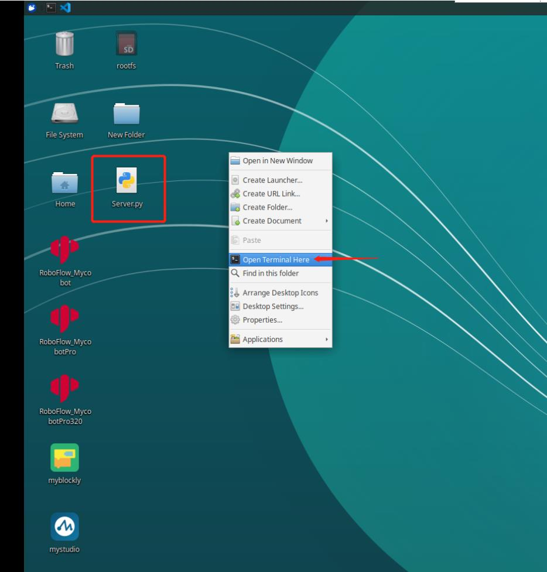

## myAGV with robot arm communication control

## Pi version

### WIFI communication control

**Note:** Only myCobot 280 Pi, myPalletizer 260 Pi, mechArm 270 Pi are supported.

1. Configure the robotic arm

**Step 1** Firstly, connect the robot arm to the display and switch on the machine, click the WIFI icon to connect to WIFI and enter the WIFI password, click Connection to connect successfully.

**Step 2** Click the desktop pymycobot file, click the demo file, copy the Server.py file to the desktop.

**Step 3** Open command terminal



**Step 4** Enter the following code to run the script:

```python
sudo python3 Server.py
```

**Step 5** Run successfully as shown:


2. myAGV communication control case

The trolley is normally switched on and connected to the display and the keyboard and mouse, the above steps ensure that the connection is good, then you can use the trolley to control the robotic arm.

**Note: The robot arm needs to be on the same network segment as the cart, i.e. under the same WIFI.**

- myCobot 280、mechArm 270：

```python
from pymycobot import MyCobotSocket
# Port 9000 is used by default 
# where "192.168.10.22" is the robot arm IP, please enter your robot arm IP yourself
mc = MyCobotSocket("192.168.10.22",9000)
mc.connect()

# The arm can be controlled when it is properly connected.
mc.send_angles([0,0,0,0,0,0],20)
res = mc.get_angles()
print(res)

...
```

- myPalletizer 260：

```python
from pymycobot import MyPalletizerSocket
# Port 9000 is used by default 
# Where "192.168.10.22" is the IP of the robot arm, please input your robot arm IP by yourself.
mc = MyPalletizerSocket("192.168.10.22"，9000)
mc.connect()

# 连接正常就可以对机械臂进行控制操作
mc.send_angles([0,0,0,0],20)
res = mc.get_angles()
print(res)

...
```

---

[← 上一页](7.1-InstallationInstructions.md) | [下一章 →](../8-FilesDownload/README.md)
