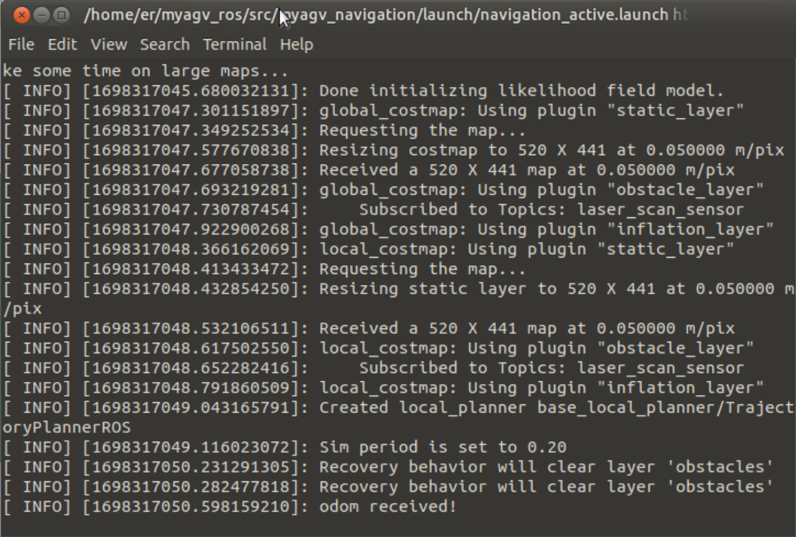
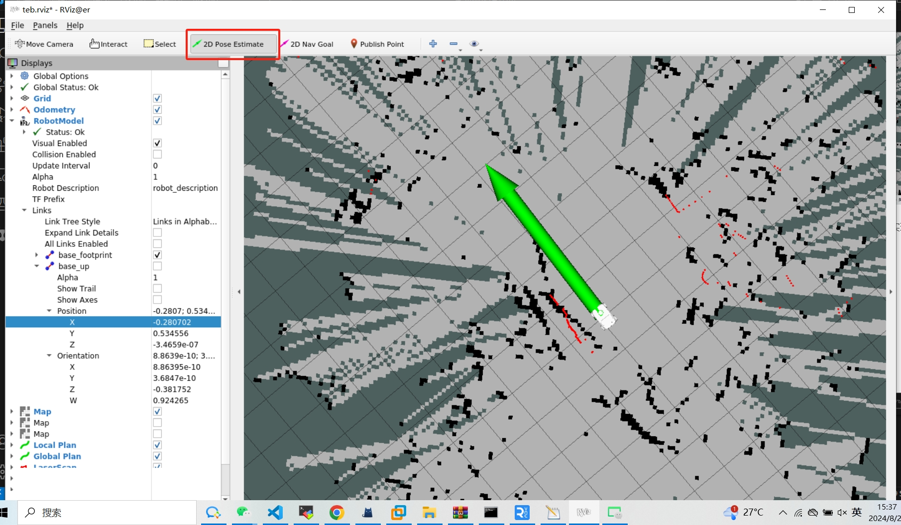

# myAGV+280JN composite robot
**Principle description**
AGV and the robot arm use socket communication. AGV controls the robot arm to perform corresponding actions by judging its own navigation status

## 1 Hardware installation

### Install the robot arm

First, you need to install the robot arm to myAGV and use screws to install the robot arm on the upper part of myAGV.


### Power connection

Connect one end of the 12V power cable with a terminal to the AGV's 12V output interface


Connect the other end to the robot's power input


## 2 Software connection

After connecting the external monitor, keyboard and mouse, the robot arm and AGV are first connected to the same wifi hotspot


Then the robot arm must first run the server script, open the terminal and run the following command

```bash
python Server.py
```


**SSH remote**
After using SSH, you can operate without a monitor
Download MobaXterm Software: https://mobaxterm.mobatek.net/download.html
Open MobaXterm software and follow the steps below:


Click the SSH icon


Enter the IP address of myAGV (for example: 192.168.123.26), then click OK. The following interface will appear. Click the corresponding IP to log in with the password.


In this interface, enter the user name: er, password: Elephant


The connection is successful as shown in the figure below


# 3 Unit test

## Robot arm test
Create a new python script on the AGV, then copy the following content and run the script,
```python

from pymycobot import MyCobotSocket
import time
arm=MyCobotSocket("192.168.1.248")#Fill in the wireless IP of the robot arm
arm.send_angles([0,0,0,0,0,0],50)#The robot arm returns to the zero position of each joint
time.sleep(2)
arm.send_angles([0,0,0,0,0,-90],50)#Robot arm joint 6 moves -90°
```

## AGV test
**Start the car control node**
```bash
//Jump to the laser radar startup directory
cd myagv_ros/src/myagv_odometry/scripts
//Power on to enable the radar. After powering on, the radar will send data through the serial port
./start_ydlidar.sh
```


**Start the keyboard control node**
```bash
roslaunch myagv_odometry myagv_active.launch
```


| Button | Direction |
| :--- | :----------------- |
| i | Move forward |
| , | Move backward |
| j | Move left |
| l | Move right |
| u | Rotate counterclockwise |
| o | Rotate clockwise |
| k | Stop |
| m | Rotate clockwise in reverse |
| . | Rotate counterclockwise in reverse |
| q | Increase linear and angular velocity |
| z | Reduce linear and angular velocity |
| w | Increase linear velocity |
| x | Reduce linear velocity |
| e | Increase angular velocity |
| c | Reduce angular velocity |

**Start the map node**

```bash
roslaunch myagv_navigation myagv_slam_laser.launch
```

**Note**: When operating the robot using the keyboard, make sure that the terminal running the myagv_teleop.launch file is the currently selected terminal; otherwise, the keyboard control program will not recognize the keystrokes.

**Start saving map node**
After the map is built, run the following command to save the built map. After saving, you can close the map node
```bash
rosrun map_server map_saver -f /home/er/myagv_ros/src/myagv_navigation/map/map
```


# 4 Composite application
**Start navigation node**
```bash
roslaunch myagv_navigation navigation_active.launch
```



Click "2D Pose Estimate" on the top toolbar Adjust so that the car in the Rviz interface and the implemented car can correspond


Use the keyboard node to drive the AGV to the destination, click RobotModel, and record the position information of the AGV at the destination, and then use the keyboard node to drive the AGV away from the destination


Then create a new python script, copy the following content into the script, and then run the script in the current path
```python
#!/usr/bin/env python
# -*- coding: utf-8 -*-

import rospy
import actionlib
from move_base_msgs.msg import MoveBaseAction, MoveBaseGoal
from geometry_msgs.msg import Point, Quaternion
from pymycobot import MyCobotSocket
import time

m = MyCobotSocket("192.168.1.118") # Fill in the wireless IP of the robot
rospy.init_node('send_goal_node', anonymous=True)
def send_goal(x, y, z, w, frame_id='map'):
    # Initialize the node
    
    # Create an action client
    client = actionlib.SimpleActionClient('move_base', MoveBaseAction)
    
    # Wait for the action server to start
    rospy.loginfo("Waiting for move_base action server to start...")
    client.wait_for_server()
    rospy.loginfo("Connected to move_base server")
    
    for i in range(3):
        # Create a goal
        goal = MoveBaseGoal()
        goal.target_pose.header.frame_id = frame_id
        goal.target_pose.header.stamp = rospy.Time.now()
        
        # Define the target position and direction
        goal.target_pose.pose.position = Point(x, y, 0.0)
        goal.target_pose.pose.orientation = Quaternion(0.0, 0.0, z, w)
        # Sending goal
        rospy.loginfo("Sending goal")
        client.send_goal(goal)
        # Waiting for results
        wait = client.wait_for_result(rospy.Duration(60.0))
        if wait:
            result = client.get_result()
            if client.get_state() == actionlib.GoalStatus.SUCCEEDED:
                rospy.loginfo("Goal reached successfully!")
                m.sync_send_angles([0, 0, 0, 0, 0, 0], 50) # Robotic arm action
                break # Exit the loop after success
            else:
                rospy.loginfo("Failed to reach the goal. Retrying...")
                time.sleep(2) # Wait 2 seconds and try again
        else:
            rospy.loginfo("Action server not available! Retrying...")
            time.sleep(2) # Wait 2 seconds and try again

if __name__ == '__main__':
    try:
    # Example target location
        send_goal(0.244428, 0.152124, -0.390851, 0.920454)
    
    except rospy.ROSInterruptException:
        rospy.loginfo("Navigation test interrupted.")
```


# 5 Effect display
AGV will navigate from the current position to the destination. After successfully reaching the destination, the robot arm will perform the action of returning each joint to zero position

