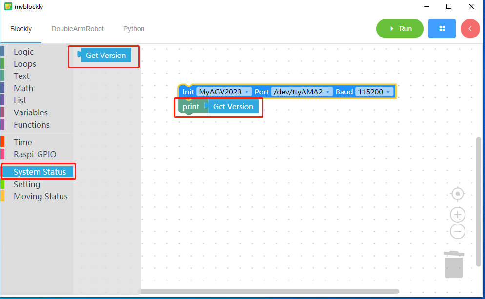
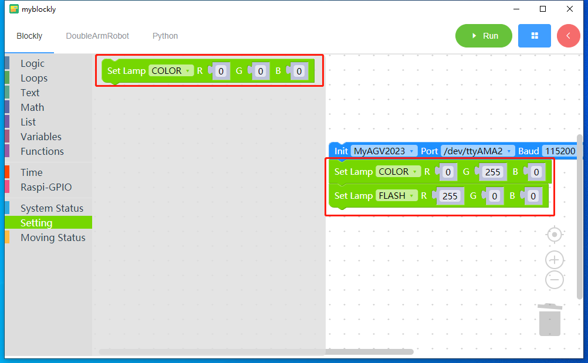
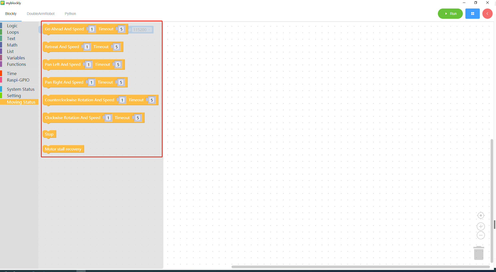

# API

## 相关构件说明

## 系统状态 System Status

- 获取版本(Get version)：运行此代码块可获取机器当前的固件版本。

  注意：系统信息栏块需要与文本输出块一起使用。

## 设置 Setting

- 设置灯块(Set Lamp block)：运行该程序块可设置机器 RGB 灯光的颜色和照明效果。效果分为：闪烁和只变色。

## 移动状态 Moving Status

- 前进程序块(Go Ahead Block)：运行该程序块可控制机器以给定速度前进，默认运动时间为 5 秒。

- 后退程序块(Retreat Block)：运行此程序块可控制机器以给定速度后退，默认运动时间为 5 秒。

- 向左平移程序块(Pan Left Block)：运行此程序块可控制机器以给定速度向左移动，默认移动时间为 5 秒。

- 向右平移程序块(Pan Right Block)：运行此程序块可控制机器以给定速度向右移动，默认移动时间为 5 秒。

- 逆时针旋转(Counterclockwise Rotation)：运行此程序块可控制机器以给定速度逆时针旋转，默认运动时间为 5 秒。

- 顺时针旋转(Clockwise Rotation)：运行此程序块可控制机器以给定速度顺时针旋转，默认运动时间为 5 秒。

- 停止程序块(Stop Block)：运行此程序块可停止机器。

- 电机失速恢复模块(Motor stall recovery Block)：运行该程序块以恢复电机失速

---

[← 上一页](./4-Q&A.md) | [下一节 →](../5.2.2-mystudio/README.md)
