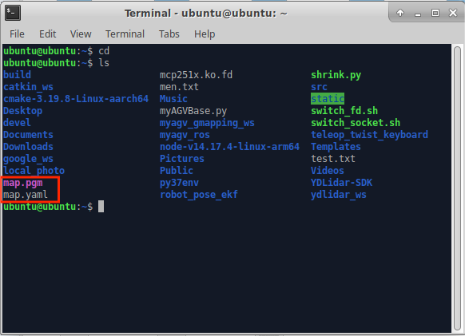

# 使用 Cartographer 实时制图

## 1. 启动小车底层的通信。

首先，检查激光雷达是否已通电并启用。如果没有接通电源，请使用终端通过脚本文件接通电源并启动激光雷达。如果激光雷达已经接通电源并正在旋转，则可以跳过接通电源并启用激光雷达（./start_ydlidar.sh）的步骤。

```bash
// 跳转到激光雷达启动目录
cd myagv_ros/src/myagv_odometry/scripts
// 上电使能雷达,上电后雷达就会通过串口发送数据
./start_ydlidar.sh
```

打开激光雷达电源后，打开终端控制台（快捷键<kbd>Ctrl</kbd>+<kbd>Alt</kbd>+<kbd>T</kbd>），在命令行中输入以下命令：

```bash
roslaunch myagv_odometry myagv_active.launch
```

**注意：在开启 launch 文件之前，请先将小车放置在需要建图环境中的一个合适起始点位上，因为开启 launch 文件将会开启小车的 IMU 传感器及 odom 里程计，人为的移动小车将造成小车建图失真。**

打开 SLAM 激光扫描和汽车车轮所需的启动文件。如果您看到

> myAGV initialized successful!
> ......
> Now YDLIDAR is scanning ......

它表示汽车激光雷达和车轮之间的通信成功。终端将显示如下状态：


## 2. 打开 Cartographer 建图 launch 文件

打开一个新的终端控制台，在命令行中输入以下命令：

```
roslaunch cartographer_ros demo_myagv.launch
```

打开小车 cartographer 建图所需的 launch 文件，若终端内不断滚动输出数据，则表示小车 cartographer 建图文件成功打开，终端内显示状态如下：


如果终端内报错，使用快捷键 Ctrl+C 关闭终端，稍微移动小车后再重新输入建图指令。终端内报错信息如下：


代码运行成功后会打开 rviz，这时在 rviz 中便会显示地图和雷达信息，红色箭头为小车的朝向。界面如图所示。


**注意：若 Rviz 仿真无法打开，可以查看 demo_myagv.launch 文件的倒数 2-4 行是否被注释，该文件的目录为/home/ubuntu/google_ws/src/cartographer_ros/cartographer_ros/launch/。若被注释只需要取消注释即可打开**

## 3. 打开键盘控制文件

打开一个新的终端控制台，在终端命令行中输入以下命令：

```
roslaunch myagv_teleop myagv_teleop.launch
```


| 按键 | 方向               |
| :--- | :----------------- |
| i    | 向前移动           |
| ,    | 向后移动           |
| j    | 向左移动           |
| l    | 向右移动           |
| u    | 逆时针旋转         |
| o    | 顺时针旋转         |
| k    | 停止               |
| m    | 顺时针反向旋转     |
| .    | 逆时针反向旋转     |
| q    | 提高线速度和角速度 |
| z    | 降低线速度和角速度 |
| w    | 提高线速度         |
| x    | 降低线速度         |
| e    | 增加角速度         |
| c    | 降低角速度         |

## 4. 开始建图

现在，小车可以在键盘控制下开始移动。操纵汽车在所需的映射空间内旋转。同时，您可以在 Rviz 空间中观察到，随着汽车的移动，我们的地图也在逐渐构建。

注意：使用键盘操作小车时，请确保运行 myagv_teleop.launch 文件的终端是**当前选定的终端**；否则，键盘控制程序将无法识别按键。此外，为了获得更好的映射效果，建议在键盘控制时**将线速度设为 0.2，角速度设为 0.4**，因为**较低的速度**往往会产生更好的映射效果。"


## 5. 保存构建的地图

打开另一个新的终端控制台，在命令行中输入以下命令，保存 agv 扫描的地图：

```
cd ~/myagv_ros/src/myagv_navigation/map

rosrun map_server map_saver
```

执行成功后，将在当前路径**(~/myagv_ros/src/myagv_navigation/map)**下生成两个默认地图参数文件，即**map.pgm**和**map.yaml**。

或者，在使用 **-f** 参数运行 **rosrun map_server map_saver** 时，可以指定路径和文件名。下面是一个示例，供参考"。

```
rosrun map_server map_saver -f /home/er/myagv_ros/src/myagv_navigation/map/map_505
```




---

[← 上一页](6.2.5-Real-time_Mapping_with_Gmapping.md) | [下一页 →](6.2.7-Navigation-Map_Navigation.md)
