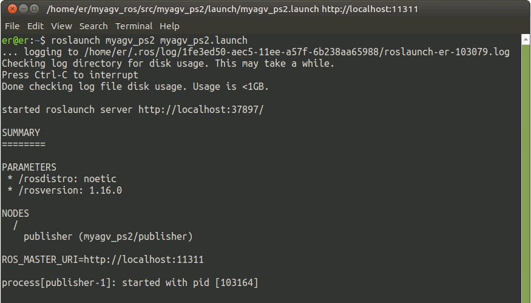
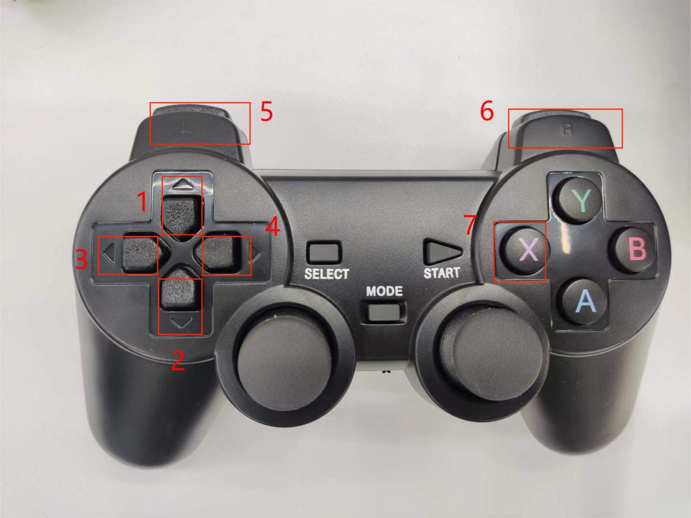

### Basic Control Based on ROS

Basic control includes **keyboard control and joystick control**. Let's first discuss the keyboard control method:

- 1 Start the communication of the car's lower layer.

First, check whether the LiDAR is powered and enabled. If it is not powered on, use the terminal to power on and start the LiDAR through the script file. If the LiDAR is already powered on and rotating, you can skip the step of powering on and enabling the LiDAR (./start_ydlidar.sh).

```bash
cd myagv_ros/src/myagv_odometry/scripts

./start_ydlidar.sh
```

After powering on the LiDAR, open a terminal console (shortcut <kbd>Ctrl</kbd>+<kbd>Alt</kbd>+<kbd>T</kbd>), and enter the following command in the command line:

```bash
roslaunch myagv_odometry myagv_active.launch 
```

Open the launch file required for the SLAM laser scan and wheels of the car. If you see:

>  myAGV initialized successful!
>  ......
>  Now YDLIDAR is scanning ......

It indicates successful communication between the car's LiDAR and wheels. The terminal will display the status as follows:


-  2 Start Keyboard Communication

Open a new terminal console and enter the following command in the terminal command line:

```bash
roslaunch myagv_teleop myagv_teleop.launch
```


| Key  | Direction                            |
| ---- | ------------------------------------ |
| i    | Forward                              |
| ,    | Backward                             |
| j    | Move Left                            |
| l    | Move Right                           |
| u    | Rotate Counterclockwise              |
| o    | Rotate Clockwise                     |
| k    | Stop                                 |
| m    | Rotate Clockwise in Reverse          |
| .    | Rotate Counterclockwise in Reverse   |
| q    | Increase Linear and Angular Velocity |
| z    | Decrease Linear and Angular Velocity |
| w    | Increase Linear Velocity             |
| x    | Decrease Linear Velocity             |
| e    | Increase Angular Velocity            |
| c    | Decrease Angular Velocity            |

**The next step is to explain joystick contro**

- 1 Start the communication of the car's lower layer.

First, check whether the LiDAR is powered and enabled. If it is not powered on, use the terminal to power on and start the LiDAR through the script file. If the LiDAR is already powered on and rotating, you can skip the step of powering on and enabling the LiDAR (./start_ydlidar.sh).

```bash
cd myagv_ros/src/myagv_odometry/scripts

./start_ydlidar.sh
```

After powering on the LiDAR, open a terminal console (shortcut <kbd>Ctrl</kbd>+<kbd>Alt</kbd>+<kbd>T</kbd>), and enter the following command in the command line:

```bash
roslaunch myagv_odometry myagv_active.launch 
```

Open the launch file required for the SLAM laser scan and wheels of the car. If you see:

>  myAGV initialized successful!
>  ......
>  Now YDLIDAR is scanning ......

It indicates successful communication between the car's LiDAR and wheels. The terminal will display the status as follows:


- 2 Launch Joystick Control Files

Currently, two types of joysticks are supported, and different files need to be run for each joystick.

- Joystick Type 1

Insert the USB receiver of the Bluetooth joystick into the car. Open a new terminal console and enter the following command in the command line:

```bash
roslaunch myagv_ps2 myagv_ps2.launch 
```



If you have reached this point successfully, you should be able to control the car's movement with the joystick. The joystick has 7 buttons to control the car's motion, as shown in the diagram: Buttons 1~4 control the forward, backward, left, and right movements of the car; Button 5 controls counterclockwise rotation, Button 6 controls clockwise rotation, and Button 7 is the stop button.



- Joystick Type 2

Insert the USB receiver of the Bluetooth joystick into the car. Open a new terminal console and enter the following command in the command line:

```bash
roslaunch myagv_ps2 myagv_ps2_number.launch 
```

> If an error occurs, indicating the absence of the "myagv_ps2_number.launch" file, please visit Github to download the latest ROS package and reinstall it for use.


If you have reached this point successfully, you should be able to control the car's movement with the joystick. The joystick has 7 buttons to control the car's motion, as shown in the diagram: Buttons 1~4 control the forward, backward, left, and right movements of the car; Button 5 controls counterclockwise rotation, Button 6 controls clockwise rotation, and Button 7 is the stop button.


---

[← Previous Page](6.2.3-Using_Common_ROS_Tools.md) | [Next Page →](6.2.5-Real-time_Mapping_with_Gmapping.md)