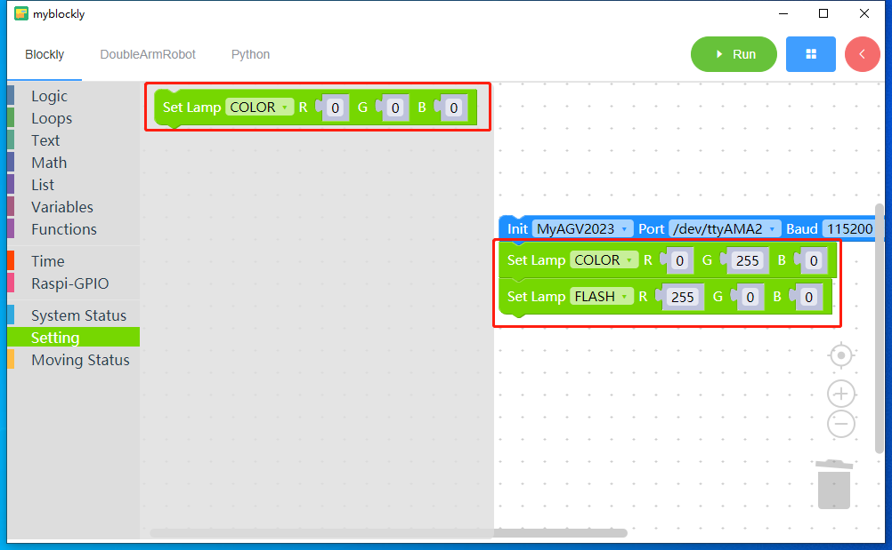

## Description of related building blocks

## System Status

  

- Get version: Run this block to get the current firmware version of the machine.

  Note: The system information bar block needs to be used with the text output block.

## Setting

- Set Lamp block: Run this block to set the color and lighting effect of the machine's RGB lights. Effects are divided into: flicker and only change color.

### Moving Status

  

- Go Ahead Block: Run this block to control the machine to move forward at a given speed,with a default motion time of 5 seconds.

- Retreat Block: Run this block to control the machine to move backward at a given speed.with a default motion time of 5 seconds.

- Pan Left Block: Run this block to control the machine to move left at a given speed.with a default motion time of 5 seconds.

- Pan Right Block: Run this block to control the machine to move to the right at a given speed.with a default motion time of 5 seconds.

- Counterclockwise Rotation: Run this block to control the machine to rotate counterclockwise at the given speed,with a default motion time of 5 seconds.

- Counterclockwise Rotation: Run this block to control the machine to rotate clockwise at the given speed,with a default motion time of 5 seconds.

- Stop Block: Run this block to stop the machine.
- Motor stall recovery Block: Run this block to stall recovery the motor

---

 [← Previous Page](./4-Q&A.md) | [Next Section →](../5.2.2-mystudio/README.md)